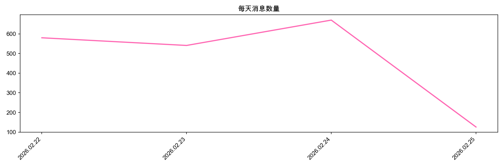
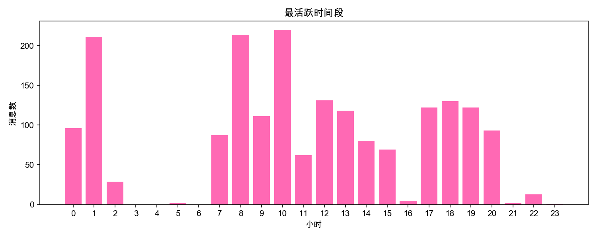
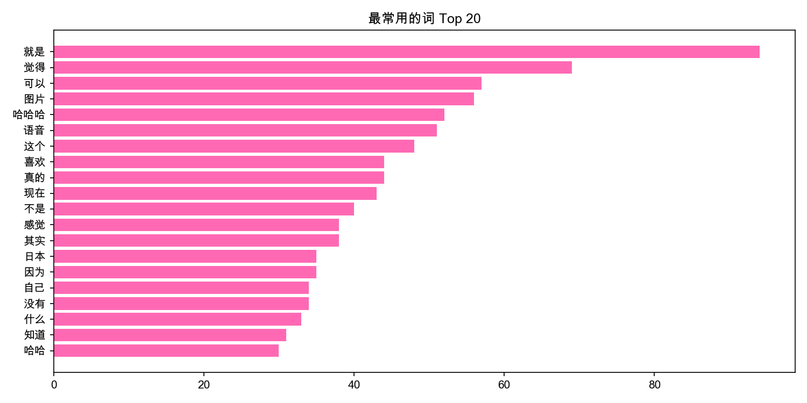

# 💬 Chat Analyzer

分析 LINE 聊天记录的 Python 小工具。

## 📊 分析内容
- 谁发的消息更多
- 每天消息数量趋势
- 最活跃的时间段
- 最常用的词 Top 20

## 🛠️ 使用方法
1. 从 LINE 导出聊天记录 txt 文件，放入 `data/` 文件夹
2. 安装依赖：`pip3 install pandas matplotlib jieba`
3. 运行：`python3 analyze.py`

## 📈 结果预览

